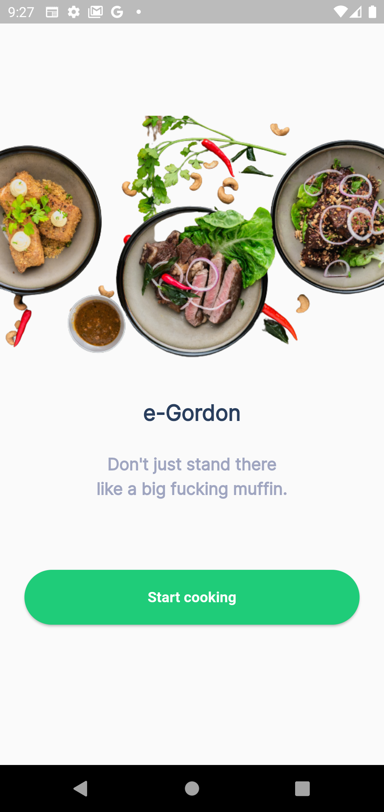
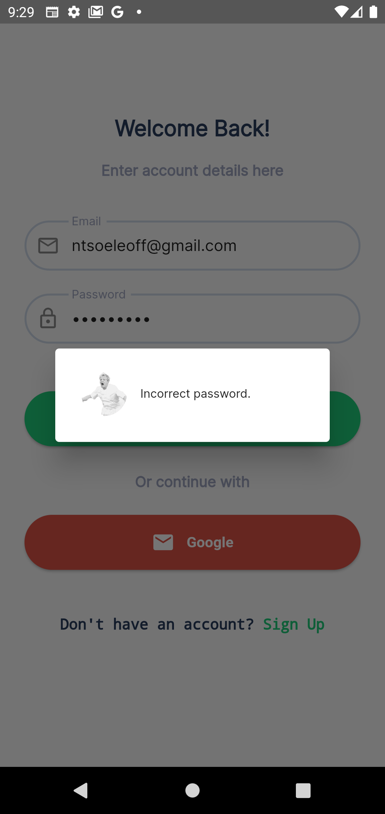

# e-gordon
# Description 
Simply put **e-gordon** is a recipe sharing social network. 
It lets you create, find, and share recipes with friends and family. 

## Key Features
- Upload recipes.
- Find recipes from other food lovers.
- Share your recipes with other food lovers.
- Create grocery lists.

# Built With
- [Flutter](https://flutter.dev/)
- [Dart.](https://dart.dev/)
- [Firebase](https://firebase.flutter.dev/)

# Screens

| Onboarding                                        | Login         |
| -------------                                     | ------------- |
|      |   |
| Error Message                                     | Verification |
| -------------                                     | ------------- |
|    |   |

